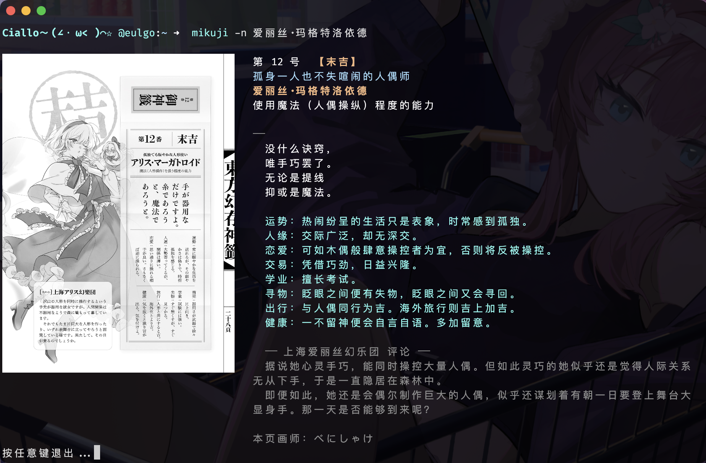

# mikuji

东方主题每日御神签。



> **关于签池**：默认签文与立绘来自 ZUN（上海爱丽丝幻乐团）官方出版物 **《东方幻存神签》**（KADOKAWA, 2025）。
> 图片版权归原作者与出版社所有。勿作商业用途，请购买原书。愿神主宽恕。

## 安装

### 前置条件

需要 Rust 工具链。如未安装：

- **Linux / macOS**: `curl --proto '=https' --tlsv1.2 -sSf https://sh.rustup.rs | sh`
- **Windows**: 前往 [rustup.rs](https://rustup.rs/) 下载安装器

或参考 [Rust 官方安装指南](https://www.rust-lang.org/zh-CN/tools/install)。

### 获取源码

```bash
git clone https://github.com/youyoEulgo/mikuji.git
cd mikuji
```

### 编译运行（临时使用）

```bash
cargo run --bin mikuji
```

### 编译安装

```bash
# 编译
cargo build --release

# 将编译好的二进制文件放进 $PATH 环境变量可达的目录
cp target/release/mikuji ~/.local/bin/

# 数据部署
# 安装后需将签池数据和图片放到数据目录。
# 创建数据目录
mkdir -p ~/.local/share/mikuji/images

# 从源码目录复制数据
cp assets/data.json ~/.local/share/mikuji/
cp assets/images/*.png ~/.local/share/mikuji/images/

# 直接运行
mikuji
```

程序运行时会自动查找数据目录，优先级如下：

| 顺序 | 路径                    | 说明                                |
| ---- | ----------------------- | ----------------------------------- |
| 1    | `$MIKUJI_DATA_DIR`      | 环境变量，完全自定义                |
| 2    | `$XDG_DATA_HOME/mikuji` | XDG 规范                            |
| 3    | `%LOCALAPPDATA%\mikuji` | Windows（若存在）                   |
| 4    | `~/.local/share/mikuji` | 默认数据目录（Linux/macOS，若存在） |
| 5    | `assets/`               | 开发时项目目录回退（若存在）        |
| 6    | `~/.local/share/mikuji` | 默认值                              |

Windows 下默认 `%LOCALAPPDATA%\mikuji\`。

数据目录结构：

```
~/.local/share/mikuji/
├── data.json    ← 签池数据
└── images/      ← 角色立绘（PNG）
```

## 终端兼容性

| 终端                     | 协议                    |
| ------------------------ | ----------------------- |
| WezTerm, iTerm2          | iTerm2 (OSC 1337)       |
| Kitty, Ghostty, Konsole  | Kitty Graphics Protocol |
| Windows Terminal, foot   | Sixel                   |
| xterm (部分), 原生 Linux | Kitty                   |

终端不支持图片时图片区域为空，文字正常显示。

### 手动指定协议

协议检测在绝大多数终端上自动进行，若自动检测失败或结果不符合预期：

```bash
MIKUJI_PROTOCOL=sixel mikuji     # 每次运行时指定
export MIKUJI_PROTOCOL=sixel     # 或设为永久环境变量
```

支持的取值：`kitty` / `iterm2` / `sixel` / `none`。

编译时选项 `--features force-sixel` 供无法正确检测协议的终端强制使用 Sixel，非必要不推荐。

## 用法

```bash
mikuji                    # 按当天日期抽取（各人结果不同，自己同一天固定）
mikuji -r                 # 真随机抽取
mikuji -n 博丽灵梦         # 指定角色
mikuji -N 84              # 指定签号
mikuji -d 2026-02-18      # 指定日期
mikuji -l ja              # 日文模式
mikuji --list             # 列出所有角色
mikuji -w 120             # 指定终端宽度
```

默认抽取的种子由 **日期 + 编译时随机数** 混合而成。同一个人同一天结果固定，不同人编译出来的二进制结果不同。`--date` 用于回看特定日期的签（含编译种子的固定结果）。

## 自定义签池

用自己的 `data.json` 和图片替换默认签池。格式：

```json
[
  {
    "name": "角色名",
    "cn_text": [
      "第",
      "1",
      "号",
      "大吉",
      "|",
      "标题",
      "角色名",
      "能力描述",
      "|",
      "诗歌第一行",
      "诗歌第二行",
      "|",
      "运势：...",
      "...",
      "|",
      "来源名称",
      "评论内容...",
      "|",
      "本页画师：xxx"
    ],
    "jp_text": [
      "第",
      "1",
      "番",
      "大吉",
      "|",
      "タイトル",
      "名前",
      "能力",
      "|",
      "詩歌...",
      "|",
      "運勢：...",
      "|",
      "上海アリス幻樂団",
      "コメント...",
      "|",
      "本页画师：xxx"
    ]
  }
]
```
图片文件名需要与 `name` 字段内容保持一致。

**块结构：**

| 块  | 内容                           | 说明                         |
| --- | ------------------------------ | ---------------------------- |
| 0   | `第, N, 号/番, 吉凶1[, 吉凶2]` | 双吉凶时前一个显示灰色删除线 |
| 1   | `标题, 角色名, 能力`           | 固定 3 行                    |
| 2   | 诗歌                           | 纯诗歌行                     |
| 3   | 运势                           | 运势行（含 `运势：` 等的行） |
| 4   | `来源名, 评论...`              | 首行为来源，余行为评论内容   |
| 5   | `本页画师：xxx`                | 可选，无画师可省略此块       |

- 每个 `|` 独占一行，分隔各块。
- 诗歌和运势不再靠冒号自动区分——全由块位置决定。
- 条数任意，增删不影响稳定性。
- 图片文件名：`角色名.png`（`·` 和 `&` 替换为 `_`）。

### 吉凶等级颜色

| 颜色   | 关键词                                                              |
| ------ | ------------------------------------------------------------------- |
| 🔴 红   | `大吉` `超大吉` `最大吉` `大大吉` `大々吉` `吉` `奇迹☆` `ミラクル☆` |
| 🔴 亮红 | `中吉` `小吉` `小小吉` `小々吉`                                     |
| 🟡 黄   | `末吉` `半吉`                                                       |
| ⚪ 白   | `平` `吉凶*` `吉或凶` `吉か凶` `吉と凶` `自行决定` `自分次第`       |
| 🔵 蓝   | `凶` `小凶` `小小凶` `小々凶` `末凶`                                |
| ⚫ 灰   | `大凶` `超大凶` `最凶` `大大凶` `大々凶` `凶猛` `末大凶`            |
| 🟣 紫   | 混合型（`大凶`+`大吉` 并存）、`不明` `乱` `无` `無`                 |

不在表中的等级默认紫色，不会报错。

## 编译种子

每次编译会在 `build.rs` 中生成一个随机数（纳秒时间戳 XOR 进程 PID），与日期种子混合。这意味着：

- 你编译出来的二进制跟别人不一样，同一天各人结果不同
- 你自己的二进制同一天结果固定
- 重新编译后种子会变，历史结果不复现
- `-r` / `--random` 不依赖种子，每次真随机

## 许可

MIT
