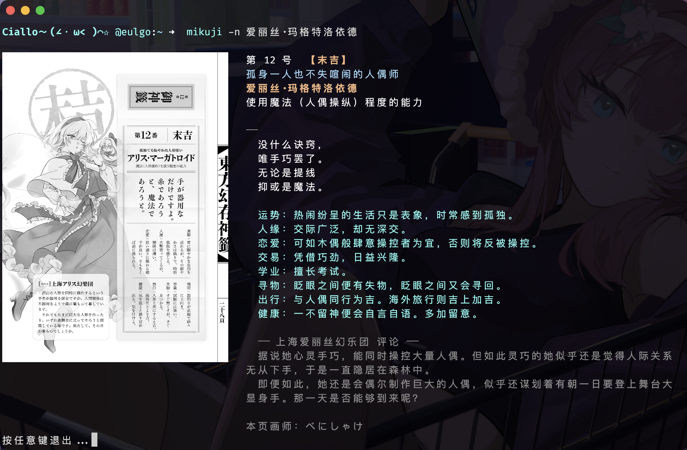

# mikuji

东方主题每日御神签。



> **关于签池**：默认签文与立绘来自 ZUN（上海爱丽丝幻乐团）官方出版物 **《东方幻存神签》**（KADOKAWA, 2025）。
> 图片版权归原作者与出版社所有。勿作商业用途，请购买原书。愿神主宽恕。

## 安装

仅支持 **Linux 与 macOS**。

### 一键安装（推荐）

```bash
curl -fsSL https://raw.githubusercontent.com/youyoEulgo/mikuji/master/scripts/install.sh | sh
```

脚本会下载对应平台的预编译二进制（Linux 为 musl 静态链接）与签池数据：

| 内容     | 默认位置                                                     |
| -------- | ------------------------------------------------------------ |
| 二进制   | `${XDG_BIN_HOME:-~/.local/bin}/mikuji`                       |
| 签池数据 | `${MIKUJI_DATA_DIR:-${XDG_DATA_HOME:-~/.local/share}/mikuji}` |

安装完成后重开终端（或按脚本提示先 `export PATH=...`），运行 `mikuji`。

> 立绘约 224 MB。只看文字签文可加 `--no-images`，只装 292 KB 的 `data.json`，签文与有图时完全一致。
> 网络慢可用 `MIKUJI_BASE_URL` 指向镜像/代理；需要固定版本用 `--version v0.5.0`。

### 安装选项

| 选项                                      | 说明                                          |
| ----------------------------------------- | --------------------------------------------- |
| `--no-images`                             | 不装立绘，仅 `data.json`（约省 224 MB）       |
| `--version <tag>`                         | 指定二进制版本，默认取最新 release            |
| `--data-version <tag>`                    | 指定签池数据 tag，默认 `data-v1`              |
| `--force`                                 | 忽略“已是最新”，强制重新下载安装              |
| `--skip-data`                             | 只装二进制，稍后自行部署数据                  |
| `--no-path`                               | 不改 shell 配置，只打印需要手动执行的命令     |
| `--quiet`                                 | 只输出最终结果                                |
| `--uninstall`                             | 卸载二进制，保留签池数据与用户种子            |
| `--purge`                                 | 配合 `--uninstall` 删除数据目录（需确认）     |
| `--reset-seed`                            | 删除 `user_seed.txt`（签运会改变，需确认）    |
| `--from-source`                           | `cargo install --git` 从源码编译（需 Rust）   |
| `--base-url <url>`                        | Release 下载前缀，用于镜像/代理               |
| `--install-dir <dir>` / `--data-dir <dir>` | 自定义安装目录 / 数据目录                    |
| `--help`                                  | 完整帮助                                      |

同名环境变量亦可使用：`MIKUJI_VERSION`、`MIKUJI_DATA_VERSION`、`MIKUJI_BASE_URL`、`MIKUJI_INSTALL_DIR`、`MIKUJI_DATA_DIR`、`MIKUJI_NO_IMAGES`、`MIKUJI_SKIP_DATA`、`MIKUJI_FORCE`、`MIKUJI_NO_PATH`、`MIKUJI_NO_VERIFY`、`MIKUJI_YES`、`MIKUJI_QUIET`。

脚本会校验 release 附带的 `checksums.txt`（SHA-256）。下载失败、校验不通过都不会留下半截数据。

### 升级与卸载

重复执行同一条安装命令即为升级。签池数据版本未变时只重新下载二进制（约 3 MB），不会重复拉取 224 MB 立绘。

```bash
# 升级到最新版
curl -fsSL https://raw.githubusercontent.com/youyoEulgo/mikuji/master/scripts/install.sh | sh

# 卸载（保留签池数据与用户种子）
curl -fsSL https://raw.githubusercontent.com/youyoEulgo/mikuji/master/scripts/install.sh | sh -s -- --uninstall

# 重置签运（删除 user_seed.txt，交互确认）
curl -fsSL https://raw.githubusercontent.com/youyoEulgo/mikuji/master/scripts/install.sh | sh -s -- --reset-seed
```

升级只覆盖 `data.json` 与 `images/`，**不会**覆盖 `user_seed.txt` 与 `config.toml`。

也可以在解压后的发布包里直接执行自带的 `install.sh`：包内已有二进制与数据时不需要网络。

### 从源码安装

需要 Rust 工具链。如未安装：

- **Linux / macOS**: `curl --proto '=https' --tlsv1.2 -sSf https://sh.rustup.rs | sh`

或参考 [Rust 官方安装指南](https://www.rust-lang.org/zh-CN/tools/install)。

注意仓库内包含全部立绘，`git clone` 约 226 MB。

```bash
git clone https://github.com/youyoEulgo/mikuji.git
cd mikuji

# 临时运行（自动使用当前目录的 assets/ 作为数据目录）
cargo run --bin mikuji

# 编译安装
cargo build --release --bin mikuji
cp target/release/mikuji ~/.local/bin/

# 手动部署数据
mkdir -p ~/.local/share/mikuji/images
cp assets/data.json ~/.local/share/mikuji/
cp assets/images/*.png ~/.local/share/mikuji/images/
```

开发时在仓库根目录运行会自动回退到 `assets/`，无需部署数据。

### 数据目录

程序运行时会自动查找数据目录，优先级如下：

| 顺序 | 路径                    | 说明                                |
| ---- | ----------------------- | ----------------------------------- |
| 1    | `$MIKUJI_DATA_DIR`      | 环境变量，完全自定义                |
| 2    | `$XDG_DATA_HOME/mikuji` | XDG 规范                            |
| 3    | `~/.local/share/mikuji` | 默认数据目录（Linux/macOS，若存在） |
| 4    | `assets/`               | 开发时项目目录回退（若存在）        |
| 5    | `~/.local/share/mikuji` | 默认值                              |

数据目录结构：

```
~/.local/share/mikuji/
├── data.json                ← 签池数据（必需）
├── user_seed.txt            ← 用户种子（首次运行自动生成）
├── config.toml              ← 配置文件（可选）
├── .mikuji_data_version     ← 安装脚本写入的数据版本标记（升级时用）
└── images/                  ← 角色立绘（PNG，可选）
```

## 终端兼容性

| 终端                     | 协议                    |
| ------------------------ | ----------------------- |
| WezTerm, iTerm2          | iTerm2 (OSC 1337)       |
| Kitty, Ghostty, Konsole  | Kitty Graphics Protocol |
| Windows Terminal, foot   | Sixel                   |
| xterm (部分), 原生 Linux | Kitty                   |

终端不支持图片时图片区域为空，文字正常显示。

### 手动指定协议

协议检测在绝大多数终端上自动进行，若自动检测失败或结果不符合预期：

```bash
MIKUJI_PROTOCOL=sixel mikuji     # 每次运行时指定
export MIKUJI_PROTOCOL=sixel     # 或设为永久环境变量
```

支持的取值：`kitty` / `iterm2` / `sixel` / `none`。

编译时选项 `--features force-sixel` 供无法正确检测协议的终端强制使用 Sixel，非必要不推荐。

## 用法

```bash
mikuji                    # 按当天日期抽取（各人结果不同，自己同一天固定）
mikuji -r                 # 真随机抽取
mikuji -n 博丽灵梦         # 指定角色
mikuji -N 84              # 指定签号
mikuji -d 2026-02-18      # 指定日期
mikuji -l ja              # 日文模式
mikuji --list             # 列出所有角色
mikuji -w 120             # 指定终端宽度
```

默认抽取的种子由 **日期 + 用户种子** 混合而成。同用户同一天结果固定，不同用户首次运行各自生成独立种子，结果不同。`--date` 用于回看特定日期的签（含用户种子的固定结果）。配置文件 `config.toml` 位于数据目录下，可手动指定图片宽度等参数。

## 自定义签池

用自己的 `data.json` 和图片替换默认签池。格式：

```json
[
  {
    "name": "角色名",
    "cn_text": [
      "第",
      "1",
      "号",
      "大吉",
      "|",
      "标题",
      "角色名",
      "能力描述",
      "|",
      "诗歌第一行",
      "诗歌第二行",
      "|",
      "运势：...",
      "...",
      "|",
      "来源名称",
      "评论内容...",
      "|",
      "本页画师：xxx"
    ],
    "jp_text": [
      "第",
      "1",
      "番",
      "大吉",
      "|",
      "タイトル",
      "名前",
      "能力",
      "|",
      "詩歌...",
      "|",
      "運勢：...",
      "|",
      "上海アリス幻樂団",
      "コメント...",
      "|",
      "本页画师：xxx"
    ]
  }
]
```
图片文件名需要与 `name` 字段内容保持一致。

**块结构：**

| 块  | 内容                           | 说明                         |
| --- | ------------------------------ | ---------------------------- |
| 0   | `第, N, 号/番, 吉凶1[, 吉凶2]` | 双吉凶时前一个显示灰色删除线 |
| 1   | `标题, 角色名, 能力`           | 固定 3 行                    |
| 2   | 诗歌                           | 纯诗歌行                     |
| 3   | 运势                           | 运势行（含 `运势：` 等的行） |
| 4   | `来源名, 评论...`              | 首行为来源，余行为评论内容   |
| 5   | `本页画师：xxx`                | 可选，无画师可省略此块       |

- 每个 `|` 独占一行，分隔各块。
- 诗歌和运势不再靠冒号自动区分——全由块位置决定。
- 条数任意，增删不影响稳定性。
- 图片文件名：`角色名.png`（`·` 和 `&` 替换为 `_`）。

### 吉凶等级颜色

| 颜色   | 关键词                                                              |
| ------ | ------------------------------------------------------------------- |
| 🔴 红   | `大吉` `超大吉` `最大吉` `大大吉` `大々吉` `吉` `奇迹☆` `ミラクル☆` |
| 🔴 亮红 | `中吉` `小吉` `小小吉` `小々吉`                                     |
| 🟡 黄   | `末吉` `半吉`                                                       |
| ⚪ 白   | `平` `吉凶*` `吉或凶` `吉か凶` `吉と凶` `自行决定` `自分次第`       |
| 🔵 蓝   | `凶` `小凶` `小小凶` `小々凶` `末凶`                                |
| ⚫ 灰   | `大凶` `超大凶` `最凶` `大大凶` `大々凶` `凶猛` `末大凶`            |
| 🟣 紫   | 混合型（`大凶`+`大吉` 并存）、`不明` `乱` `无` `無`                 |

不在表中的等级默认紫色，不会报错。

## 配置文件

可在数据目录下创建 `config.toml` 进行自定义设置：

```toml
image_width = 80      # 图片宽度（单元格列数）
language = "cn"        # 默认语言
```

未配置的项使用默认值。不要随便删除 `user_seed.txt`，否则命数皆变。

## 用户种子

首次运行时会自动在数据目录生成 `user_seed.txt`，此后固定复用。这意味着：

- 每个用户首次运行时生成独立种子，不同人结果不同
- 删除种子文件后下次运行会自动重新生成（结果会变）
- 发布预编译二进制不受影响——每个用户首次运行各自获得独立种子
- `-r` / `--random` 不依赖用户种子，每次真随机

## 许可

MIT
